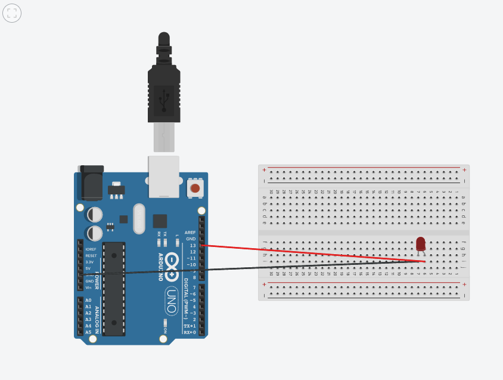
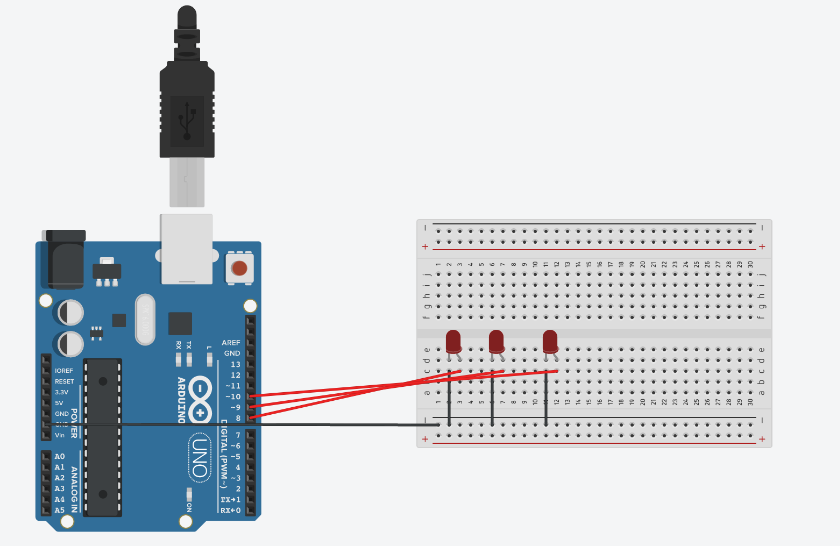
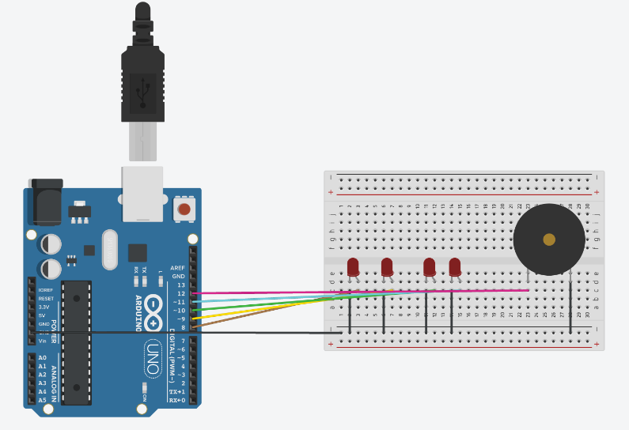
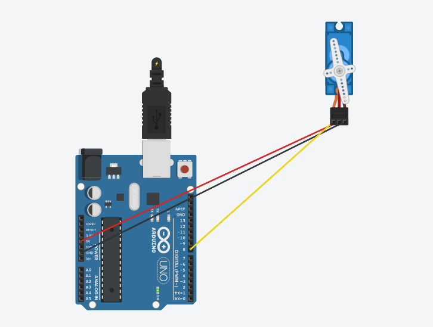
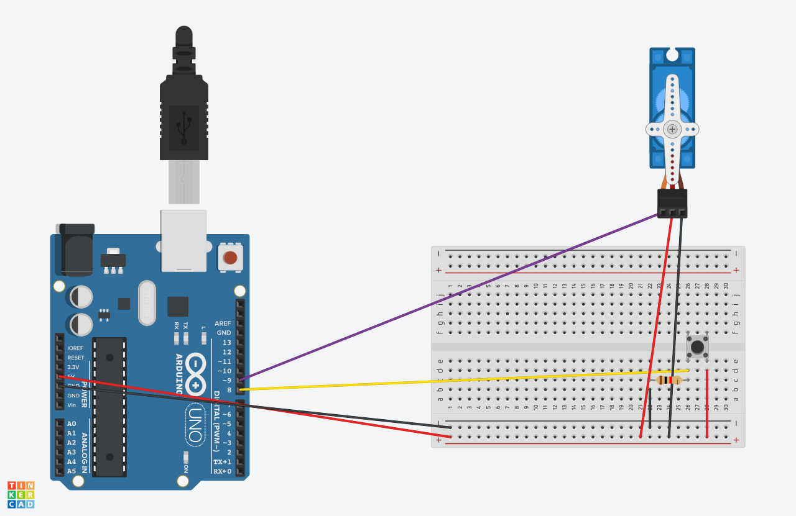
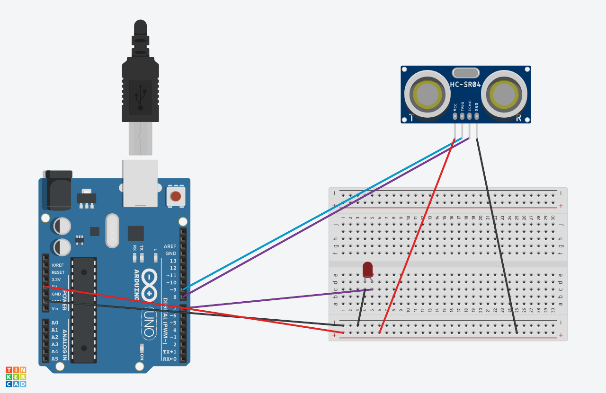
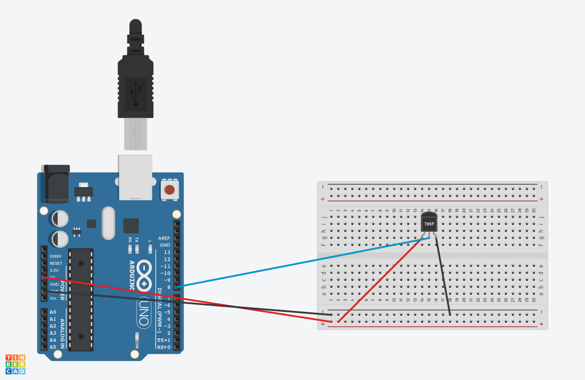

# Prácticas Obligatorias Arduino | Abel García


### Ejercicio 1
Conectamos un diodo led, haciendo lo siguiente
1. Se conecta el polo positivo del led a un pin de Arduino.
2. El polo negativo a tierra (GND).



En cuanto al código, usamos la función `pinMode()` para indicarle a Arduino que el led es una salida, mediante la palabra clave `OUTPUT`, luego con `digitalWrite()` y las palabras clave `HIGH` y `LOW` encendemos y apagamos el led. La función `delay()` sirve para detener la ejecución durante los milisegundos que se le pasan como parámetro. 
***
### Ejercicio 2
Se conectan 3 leds igual que se hizo en el ejercicio anterior y se modifica el código para declarar en el `setup()` los otros dos led. Con un bucle `for()` los encedemos y apagamos consecutivamente.


***
### Ejercicio 3
Añadimos un led más y modificamos el código para añadir el zumbador que se conectará respetando su polaridad.



Con un bucle for encedemos y apagamos consecutivamente los 3 primeros led. Cuando termina y sale del bucle encendemos el 4º led, activamos el zumbador con la función `tone()` a la cual se le pasan el pin al que está conectado el zumbador y la frecuencia a la que queremos que emita en Hz, lo dejamos sonando unos 200ms y lo desactivamos con la función `noTone()`. A continuación apagamos el led.
***
### Ejercicio 4
Conectamos un servo-motor, de la siguiente manera
1. Un cable a tierra (gnd)
2. Otro a la salida de 5V
3. El tercero a uno de los pines de Arduino.



 Para que sea más cómodo trabajar con el servo, importamos la biblioteca `Servo.h`.
 
  En el `setup()` tan sólo necesitamos la función `attach()` para indicar en que pin hemos conectado el servo.
  
   Mientras que en el `loop()` tenemos dos bucles `for()`, uno que va aumentando los grados de 0º a 180º y otro que los disminuye, de 180º a 0º. En el interior de estos bucles usamos la función `write()` para poner el motor en la posición que se le pasa como parámetro, la cual va a aumentando en 1º por cada pasada del bucle. Esta función `write()` va a acompañada de un delay de 25 milisegundos.
***

### Ejercicio 5
En este caso necesitamos conectar un pulsador, lo cual se hace de la siguiente manera:
1. Un pin a la salida de 5V de la placa.
2. De otro pin una resistencia a tierra (gnd) y un cable a un pin.



En cuanto al código, necesitamos añadir dos líneas al `setup()`
```c
pinMode(pulsador, INPUT);
Serial.begin(9600);
``` 
Estas líneas nos sirven para indicarle a la placa que el pulsador es una entrada y para iniciar una comunicación entre la placa y el botón la cual es necesaria para leer posteriormente el estado del pulsador.

En el `loop()` creamos un bucle `while()` que mientras el pulsador esté activo aumente el valor de la variable `angulo` y la escriba en el servo. También usamos una función `if()` para que cuando `angulo`  llegue a a 180º, empiece a dismunir su valor de forma similar a como ocurría en el anterior ejercicio con los dos bucles `for() `.

***

### Ejercicio 6
Para este ejercicio necesitamos conectar, además del led, un sensor de proximidad. Lo cual se hace de la siguiente manera:
1. La pata **GND** se conecta al conector de tierra e la placa (GND).
2. La pata **VCC** se conecta a la salida de 5V.
3. Las patas **Trigger** y **Echo** se conectan a dos pines cualesquiera de nuestro Arduino.



En el `setup()` debemos abrir una comunicación con la placa y declarar el pin **Trigger** como salida, ya que es el que emitirá la señal de ultrasonido y el pin **Echo** como entrada, ya que es el receptor.

En el `loop()`, lo primero que haremos será lanzar una señal por el triger, la cual será de muy poca duración (10µs). Para realizar esta espera tan corta no podemos usar la función `delay()` ya que esta admite solamente milisegundos como parámetro, usaremos la función `delayMicroseconds()`.
Despues, para calcular la distancia, necesitamos recoger el tiempo que tarda la señal enviada por el **Trigger** en ser recibida por el **Echo**. Para ello usamos la función `pulseIn()` que recibe dos parámetros, el pin echo y `HIGH` que es la señal que esperamos recibir.
Lo siguiente y último es calcular finalmente la distancia en cm para lo cual utilizamos la siguiente operación `distancia = duracion / 2 / 29.1`;

Una vez tenemos este dato usamos un `if()` para encender y apagar el led en consecuencia.
***

### Ejercicio 7
Para este ejercicio usaremos un sensor **DHT11** cuya conexión con la placa Arduino es sencilla:
1. El pin VCC a la salida de 5V.
2. El pin Ground al conector de GND.
3. El pin Signal a un pin cualquiera de la placa.



Para controlar este sensor, necesitamos importar la biblioteca `DHT.h` y crear un objeto `DHT`, indicando el pin al que esta conectado el sensor y su tipo, en este caso **DHT11**.

En el `setup()` inicializamos la conexión placa-sensor con `Serial.begin()`,como se ha explicado en ejercicios anteriores, e iniciamos también el sensor con la instrucción `dht.begin()`.

En el `loop()` usamos las funciones `readHumity()` y `readTemperature()` para leer estos dos valores y guardarlos en sendas variables para luego mostrarlas por consola.
***
### Ejercicio 8
Para este ejercicio se usará una pantalla lcd conectada a un bus I2C para facilitar la conexión y el código.

Son necesarias dos librerias, `Wire.h` y `LiquidCrystal_I2C.h`.

Para empezar, creamos un objeto **LiquidCrystal_I2C**, pasando como parámetros, la dirección de memoria que ocupará, el número de columnas y el número de filas.

Como vamos a escribir un texto estático no necesitamos el bucle `loop()`, todo nuestro código irá en el `setup()`.

Para este programa solo son necesarias tres líneas
```c
lcd.init();
lcd.backlight();
lcd.print("Hola Mundo ");
```

La primera para iniciar la pantalla lcd, la segunda para encender la luz trasera y la tercera para escribir el texto deseado.